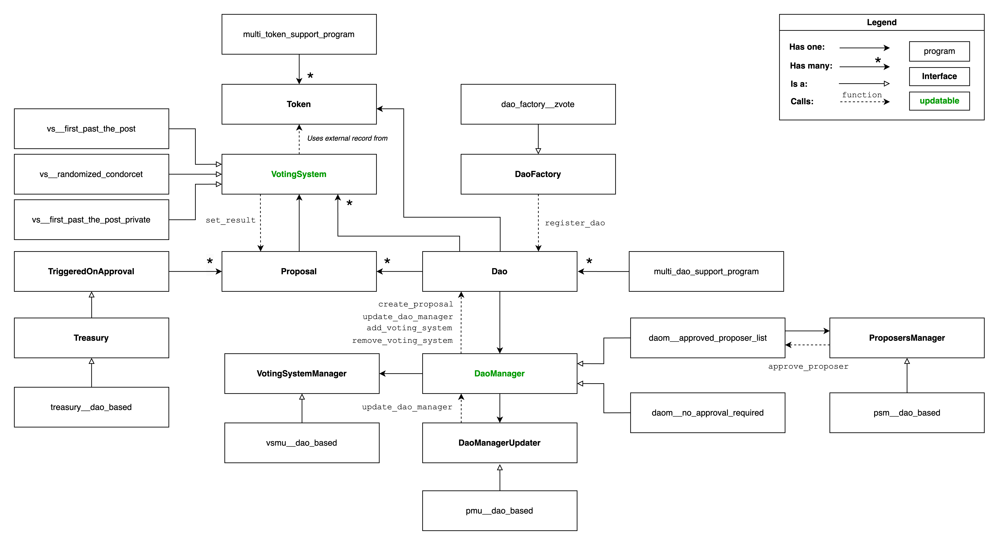

<h1 align="center">
    <picture>
        <source media="(prefers-color-scheme: dark)" srcset="./media/logo-dark.png" width="170">
        <source media="(prefers-color-scheme: light)" srcset="./media/logo-light.png" width="170">
        
    </picture>
</h1>

<p align="center">
    <a href="https://zvote.io"> </a>
    <a href="https://zvote.io"></a>
</p>

<p align="center">
    <b>DAO Framework on Aleo</b>
</p>

zVote is framework for building **modular**, **upgradable** and **private** DAOs on Aleo.

It can integrate with any voting system, and is capable of executing arbitrary code onchain. Each of its component is customizable and updatable, through any desired mechanism, including voting making DAO auto-upgradability possible.

This modularity is achieved using Aleo's interoperability between programs. It leverages **`multi_token_support_programv1`** for interacting with governance tokens and managing treasury holdings. Additionally it also utilizes **[Aleo DCP](https://github.com/bandersnatch-io/aleo-dcp/blob/main/README.md)** to implement voting systems with private ongoing results.

## Concepts

zVote components are defined as interfaces with the following relationships:



The motivation behind this design is to encourage, DAOs and developers to propose their own implementation of these interfaces. Communities can then vote to upgrade their DAO to the most suitable implementations according to their specific use cases.

### DAOs

As for tokens with **`multi_token_support_programv1.aleo`**, DAOs are supported by a single registry program: **`multi_dao_support_program.aleo`**. Every DAO has a `DaoManager`, itself upgradable, that is responsible for administrating most features and parameters of the DAO. In particular it can create `Proposal` objects.

### Proposal

A `Proposal` can be approved by a `VotingSystem`. Once approved, it triggers the corresponding actions within the DAO, potentially interacting with the treasury or arbitrary on-chain logic implemented by a `TriggeredOnApproval` transition.

### DaoManager

A `DaoManager` has a `VotingSystemManager` handling corresponding DAO's `VotingSystem` list.

`DaoManager` also manages who can create proposals, the repository has two available implementations for now:

- Anyone can create proposals: **`dm__dao_based.aleo`**.
- Or just a list of addresses managed by a `ProposersManager` can: **`dm__dao_based.aleo`**.
**`psm__dao_based_001.aleo`** provides an implementation of a `ProposersManager` that allows new allowed proposers on accepted specific proposal.

### DaoManagerUpdater

A `DaoManager` can be updated by a `DaoManagerUpdater`. The repository provides a voting based implementation: **`vsmu__dao_based.aleo`**

### VotingSystemManager

A `VotingSystemManager` can add or remove `VotingSystem` from a DAO. The repository has a voting based implementation of this interface: **`vsmu__dao_based.aleo`**

### VotingSystem

A `VotingSystem` is a program that is responsible for setting results of a `Dao`'s `Proposal`. It can do it any arbitrary way.

### DaoFactory

A factory is a helper program for creating the DAO be just calling a single transition.

**`dao_factory__zvote.aleo`** provides such a transition for creating an auto-upgradable DAO.

## Example

To create a DAO with a simple default quorum based 2 candidates (true/false) voting system:

In `programs/DaoFactory/dao_factory__zvote.aleo`:

```bash
leo run register_proposer_list_dao \
    \ # Dao ID
    888field \
    \ # Gouvernance token MTSP Token ID: Credits Wrapper
    3443843282313283355522573239085696902919850365217539366784739393210722344986field \
    \ # Voting system:
    vs__2_candidates.aleo \ 
    \ # Voting parameters hash: BHP256::hash_to_field({ candidates: [0field, 0field] })
    5861753428027966921366446481874909916006942163617226737729187037817006635040field \
    aleo1qqqqqqqqqqqqqqqqqqqqqqqqqqqqqqqqqqqqqqqqqqqqqqqqqqqq3ljyzc \
    aleo1qqqqqqqqqqqqqqqqqqqqqqqqqqqqqqqqqqqqqqqqqqqqqqqqqqqq3ljyzc \
    psm__dao_based_001.aleo 
```

It runs the following leo program then registers the DAO:

```rust
import multi_dao_support_program.aleo;
import daom__approved_proposers_001.aleo;
import daom__no_approval_required.aleo;

program zvote_dao_factory_002.aleo {
    async transition register_proposer_list_dao(
        public dao_id: field,
        public token_id: field,
        public initial_voting_system: address,
        public initial_vs_params_hash: field,
        public dao_manager_updater: address,
        public voting_system_manager: address,
        public proposers_manager: address,
    ) -> Future {
        let register_dao_future: Future =
            multi_dao_support_program.aleo/register_dao(
                dao_id,
                token_id,
                daom__approved_proposers_001.aleo,
                initial_voting_system,
                initial_vs_params_hash
            );
        let init_as_dao_manager_future: Future =
            daom__approved_proposers_001.aleo/init_as_dao_manager(
                dao_id,
                dao_manager_updater,
                voting_system_manager,
                proposers_manager
            );
        return finalize_register_proposer_list_dao(
            register_dao_future,
            init_as_dao_manager_future
        );
    }
    async function finalize_register_proposer_list_dao(
        register_dao_future: Future,
        init_as_dao_manager_future: Future
    ) {
        register_dao_future.await();
        init_as_dao_manager_future.await();
    }
}
```
